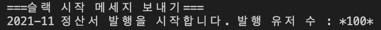
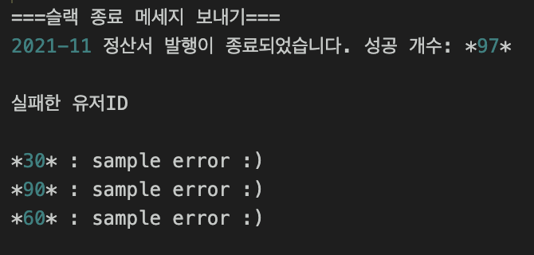

Sidekiq-batch Example
---------------------

### 설치해야 하는 gem
```
gem 'sidekiq'
gem 'sidekiq-batch'
```

### 이 파일을 위주로 보세요
```
app/jobs/batch_job.rb
config/initializers/sidekiq-batch.rb
```

### 직접 실행 해보려면 
1. git clone
2. bundle install
3. RDB, 레디스 서버 켜기
```
mysql.server start
redis-server
```
4. db 세팅
```
rails db:create
rails db:migrate
rails db:seed
```
5. sidekiq 프로세스 실행시키기
```
bundle exec sidekiq
```
6. rails 콘솔에서 서비스 호출해 보세요~
```
rails c
CreateBillService.new('2022-08').create
```
7. sidekiq 대시보드 확인하고 싶다면
```
rails s
localhost:3000/sidekiq 방문
```




### batch-job 사용하기

1. batch로 실행하고 싶은 job 클래스에 다음과 같은 클래스 메소드를 정의한다
```
  send_start_message(description, total_count)
  send_end_message(description, success_count, failed_arguments)
```

2. batchjob 호출하기
```
  batch_job = BatchJob.new('CreateBillJob', @month, 'create_bill')
  batch_job.push_jobs(User, 1000) do |users|
    # job_arguments
    users.map { |user| [user.id, @month] }
  end
```